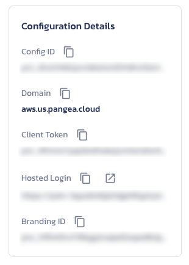
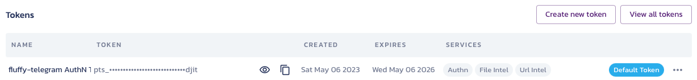
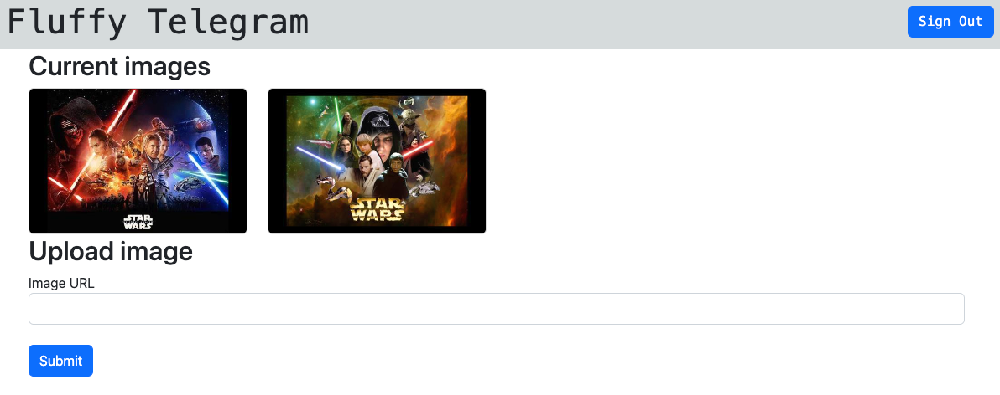

# Fluffy Telegram

Remote controlled picture frame using a Raspberry Pi. This is designed as a multi-user system, where one user can upload images to one device. This is a sample app showing how to use the [Pangea](https://pangea.cloud) services with Azure.

The device code is written in Python. The server side API is written in Python using Azure functions, and the client app to manage images is written in Typescript using NextJS.

> This is a demo app, and is still under development

## Configuration

To run this app, you will need to configure a few things.

The first thing you need is to define numerical IDs for your devices. These will be set in multiple places.

### Setup Azure services

This app uses Azure storage to store images, as well as to provide a queue to get your device to update when images are uploaded. You will need to set up the following:

- An Azure storage account. This needs:
    - 2 containers, one called `images` and one called `users`
        - In the `users` container, create one document per user called `<email_address>.json` with the following contents:
            ```json
            {
                "device": "<device ID>"
            }
            ```

            Replacing `<device ID>` with the device Id for the user.
    - 1 queue per device, called `images-<device_id>`. For example, if you have 1 device with the device ID of 1, set this to `images-1`
- An Azure Functions app. This is optional as you can run the functions app locally, but if you want to deploy to the cloud you will need this.
- Azure App Service. This is optional to deploy the admin app as you can run this locally, but if you want to deploy to the cloud you will need this.

### Setup your device

The hardware for this is based around a Raspberry Pi with a screen, such as the [GeeekPi Raspberry Pi 4 TFT 3.5 inch Touch Screen with Case](https://amzn.to/42eNtfW). Set up the Pi with the desktop Raspberry Pi OS 64-bit (not Lite), and install some additional software:

- [feh](http://feh.finalrewind.org) - `sudo apt install feh`
- Copy the code from the [`device`](./device) folder onto a folder on the Pi, then install the Python requirements - `pip install -r requirements.txt`
- Set up the `.env` file by remaning from `.env.example` to `.env`. You will need to set up the values:

    - Set `STORAGE_CONNECTION_STRING` to the connection string for your Azure storage account
    - Set `DEVICE_ID` to a numerical ID for your device

- Install the software for the screen if required

Then run the Python app:

```bash
python3 app.py
```

If you want the app to autostart when the device boots, add a new autostart file:

```bash
sudo nano /etc/xdg/autostart/fluffytelegram.desktop
```

Then add the following:

```text
[Desktop Entry]
Exec=lxterminal --command "/bin/bash -c 'python /home/pi/fluffy-telegram/app.py; /bin/bash'"
```

This assumes the code is in the `fluffy-telegram` folder in the Pi users home folder. Change this as necessary.

When you reboot the device, the app will start automatically.

### Setup your Pangea account

This app uses Pangea's services to provide auth as well as checking URLs and files for malicious content. You will need to create a [Pangea project](https://pangea.cloud) to use this app. This project needs a token that supports:

- AuthN
- File intel
- URL intel

You will also need to set up the redirection url for the admin app. Assuming you are running the admin app locally, this will be `http://localhost:3000/`. This will need to be set as the default hosted redirect.


### Setup the functions app

The Azure Functions app provides API access for the app. To run this you will need to install the [Azure Functions core tools](https://learn.microsoft.com/azure/azure-functions/functions-run-local), or open this repo in a GitHub codespace.

All the dependencies are in the `requirements.txt` file:

```bash
pip install -r requirements.txt
```

You will need to configure the local settings for this app (or upload these if you deploy this app to Azure). Rename `local.settings.json.example` to `local.settings.json` and update the values:

- `STORAGE_CONNECTION_STRING` - this is the connection for the storage account
- `PANGEA_DOMAIN` - the domain from your Pangea project

    

- `PANGEA_TOKEN` - the token for yout Pangea project

    

### Setup the admin app

The Admin app is a NextJS app that manages authentication via Pangea's AuthN service, and allows you to view the images on a device and upload new ones.

You will need npm installed, then run this command to install the required packages:

```bash
npm install next@latest react@latest react-dom@latest
```

You will need to configure the app to connect to both your functions app, and the Pangea AuthN service. Rename `env.local.example` to `env.local` and update the values:

- `NEXT_PUBLIC_PANGEA_DOMAIN` - the domain from your Pangea project

    

- `NEXT_PUBLIC_AUTHN_CLIENT_TOKEN` - the client token from your Pangea project
- `NEXT_PUBLIC_AUTHN_HOSTED_LOGIN_URL` - the hosted login url from your Pangea project

- `AUTHN_SERVICE_TOKEN` - the token for yout Pangea project

    

- `API_URL` - The URL of your function app. For example, if you are running locally this will be `http://localhost:7071/api`

Then launch the app using `npm run dev` and the app will run locally on port 3000.

## Run using GitHub Codespaces

This app is configured to run using GitHub codespaces, or in a container using VS Code remote development.

Open this repo in the codespace/container and it will install all the components and setup that you need. You will need to configure the `local.settings.json` file in the functions app and the `.env.local` file in the admin app.

The Codespace will need some URL configuration:

- When this repo is opened in codespaces, the ports should already be configured, but they will need to be made public. Right-click on the `admin-app` and `function-app` ports and set the visibility to public

    

- The Pangea redirect needs to be set to the `admin-app` port. Copy the address of this and set it as the default hosted redirect URL.

    

- The admin app needs to be configured to point to the functions app. Copy the address of the `function-app` and set it in the `.env.local` file in the admin app, ensuring it ends in `/api`

    ```ini
    API_URL=https://jimbobbennett-miniature-space-fiesta-xxxxx-7071.preview.app.github.dev/api/
    ```

## Use the app

Once the app is running, open it in your browser.

- Sign in using the **Sign in** button. You will need to create an account if you don't have one. Make sure this matches a user account in the users container.
- Upload images using the image URL box. At the moment only uploading from a URL is supported.
- Once the image is uploaded, the screen will refresh to show the image, and it will appear on the device.

    

- You can test the malicious URL detection by uploading from `http://113.235.101.11:54384`, the exmaple malicious URL from the Pangea documentation.
